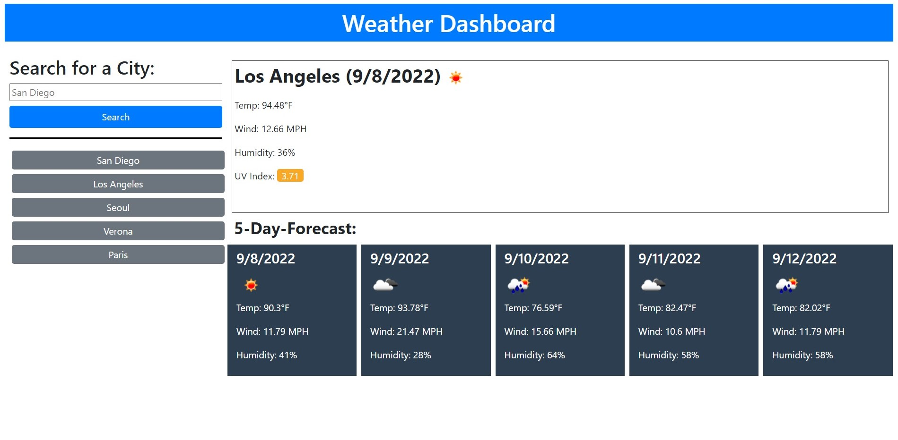

# Weather Dashboard

## About

This application is a weather dashboard that allows the user to check their city or other cities around them for weather updates!

The user can search up their city and if the city exists, the application will return information about the current weather (including temperature, wind speed, humidity, and UV Index) as well as information for the next five days in a separate section. 

The city searched will be added to the Search History below the submit form, provided that it was not searched up beforehand. The Search History will keep track of the last 10 unique entries. Users can click on the buttons in the Search History to pull up the data for that city once more.

The program will kindly inform if the city inputted in the search bar does not exist, and it will not be added into the Search History.

The Search History persists even on page reload, and the program will automatically display the most recent entry from the search history.

## Process

This application uses the OpenWeather API (https://openweathermap.org/api) to get information about the current and upcoming weather.

Here are the following APIs used and their respective documentation links:
- Geocoding API (https://openweathermap.org/api/geocoding-api) : used to get the latitude and longitude of the city being searched
- Current weather data (https://openweathermap.org/current) : used to get the current weather information
- OneCall API v2.5 (https://openweathermap.org/api/one-call-api) : used to get the forecast for the next five days & and current UV Index

Special mention: OpenUV API (https://www.openuv.io/uvindex) provided a color chart which provided the basis of how the UV index would be displayed on the app. (I actually tried using this API for the UV index but halfway through it gave me a 500 Internal Server Error 🙃)

## Links

GitHub Repository Link: https://github.com/cindyung56/weather-dashboard

Link to Live URL Page: https://cindyung56.github.io/weather-dashboard/